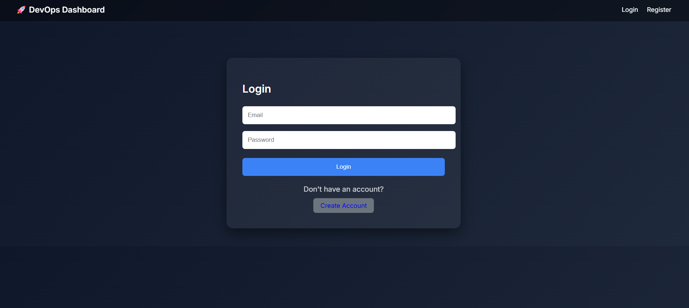
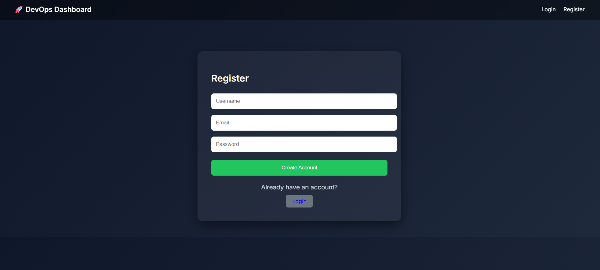

<div align='center'>
    <h1 align='center'> DevOps Flask Dashboard by Aman </h1>
    <p align='center'> A Flask-based mini DevOps platform that lets users register projects, pull GitHub repositories, auto-discover Dockerfiles, build and run containers, stream deployment logs, and monitor live deployment activity from a centralized dashboard. </p>
    <div>
        
        
        
        
        
        
    </div>
</div>

### Project Overview

*This project focuses on building a lightweight Heroku / Render style deployment dashboard with Flask, Docker, and Git-based deployment automation for personal projects and demo infrastructure workflows.*

- **GitHub Repository Deployment:** Register a repository URL, clone it into the local `deployments/` workspace, and deploy it as a Docker container.
- **Dockerfile Auto-Discovery:** Searches the repository tree for a `Dockerfile` and prefers the repository root Dockerfile when available.
- **Build and Run Pipeline:** Automatically builds Docker images and starts containers with isolated names and port mappings per project.
- **Real-Time Deployment Logs:** Streams deployment output while clone, build, and container startup steps are running.
- **Deployment History and Progress Tracking:** Stores deployment records with timestamps, statuses, progress percentages, and durations.
- **Container Controls:** Restart or stop deployed containers directly from the dashboard.
- **System and Docker Monitoring:** Exposes CPU, memory, and running-container metrics, along with Docker container usage stats.
- **GitHub Webhook Auto Deploy:** Supports push-triggered deployments for the `main` branch using webhook signature verification.

<div align='center'>
    
    <p align="center"><em>Project dashboard with deployment controls, activity tracking, and live status visibility</em></p>
</div>

<div align='center'>
    
    <p align="center"><em>Deployment workflow, monitoring endpoints, and repository-based container operations</em></p>
</div>

### Tools and Technologies

| Tool / Library | Purpose |
|------|-------------|
| Flask | Web framework and route handling |
| SQLAlchemy | Database ORM for users, projects, and deployments |
| Flask-Login | Session-based user authentication |
| Docker CLI | Image build, container run, stop, restart, and stats |
| Git | Clone and pull project repositories |
| Jinja2 | Server-rendered HTML templates |
| SQLite | Local development database |
| Gunicorn | Production WSGI server dependency |
| psutil | Host CPU and memory monitoring |
| Python | Application logic and background deployment workflow |

### Pipeline Workflow

**(1) User Authentication**

- A user registers or logs in through the Flask dashboard.
- Each project and deployment is scoped to the authenticated user.

**(2) Project Registration**

- The user creates a project by providing a project name and GitHub repository URL.
- Project metadata is stored in the database.

**(3) Repository Sync**

- On deployment, the system clones the repository into `deployments/project_<id>/`.
- If the repository already exists locally, it pulls the latest changes instead.

**(4) Docker Build**

- The app searches for a `Dockerfile` in the repository.
- A Docker image is built for the selected project using the discovered build context.

**(5) Container Launch**

- Any existing project container is removed.
- A new container is started with a predictable image name, container name, and forwarded port.

**(6) Health Check and Monitoring**

- The app performs a basic HTTP readiness check after launch.
- Deployment logs, Docker stats, and system metrics are exposed to the dashboard UI.

**(7) Operations and Automation**

- Users can stop or restart containers manually.
- GitHub webhook pushes to `main` can trigger automated redeployments.

### Features

| Feature | Description |
|------|-------------|
| User Authentication | Register and log in to manage your own deployment workspace |
| Project Creation | Add GitHub repositories as deployable projects |
| Dockerfile Discovery | Automatically find the correct Dockerfile inside a repository |
| One-Click Deployment | Clone / pull, build image, run container, and check health |
| Real-Time Logs | Stream deployment logs while the pipeline executes |
| Deployment History | Review previous deployments, status, duration, and progress |
| Container Controls | Stop or restart project containers from the UI |
| Resource Monitoring | Inspect host CPU / RAM and Docker container stats |
| GitHub Webhook Deploy | Trigger automatic deployments on repository pushes |

### Setup on Your Machine

#### Prerequisites

- Python 3.10+ recommended
- Docker installed and running
- Git installed and available on your system path
- PowerShell or another terminal for local development

#### Clone Repository

```bash
git clone <your-repo-url>
cd devops-flask-dashboard
```

#### Create Virtual Environment (Recommended)

```bash
python -m venv venv
```

Activate on Windows PowerShell:

```bash
.\venv\Scripts\Activate.ps1
```

#### Install Dependencies

```bash
pip install -r requirements.txt
```

#### Initialize the Database

```bash
python -c "from app import create_app, db; app=create_app(); app.app_context().push(); db.create_all()"
```

#### Start the App

```bash
python run.py
```

Open:

`http://localhost:5000`

### Project Structure

| Path | Description |
|------|-------------|
| `run.py` | Local Flask app entry point |
| `config.py` | App configuration including SQLite DB and cookie settings |
| `app/__init__.py` | Flask app factory, DB setup, login manager, and CSRF protection |
| `app/models.py` | SQLAlchemy models for users, projects, and deployments |
| `app/routes.py` | Authentication, deployment pipeline, monitoring APIs, and webhook routes |
| `app/templates/` | Jinja templates for dashboard, auth, logs, and deployment history views |
| `deployments/` | Local cloned repositories created at runtime |
| `requirements.txt` | Python dependencies for the dashboard |
| `Dockerfile` | Containerization file for the dashboard app itself |
| `docker-flask-example/` | Example Dockerized Flask project included in the repository |

### Key Endpoints

| Route | Purpose |
|------|-------------|
| `/` | Main dashboard with project and deployment overview |
| `/projects/create` | Create a new deployable GitHub project |
| `/projects/<id>/deploy` | Start a project deployment |
| `/deployment-history/<id>` | View deployment logs and historical details |
| `/api/deployment-logs/<id>` | Server-sent event stream for live deployment logs |
| `/api/docker-stats` | Docker container usage metrics for owned projects |
| `/system-stats` | Host CPU, memory, and running-container summary |
| `/webhook/<id>` | GitHub webhook endpoint for push-triggered deploys |

### Stopping the App

| Action | Command |
|------|-------------|
| Stop Flask server | Press `CTRL+C` in the terminal |
